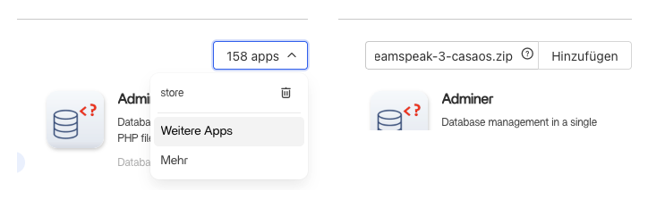

# TeamSpeak 3 Docker Compose

A self-hosted [TeamSpeak 3](https://www.teamspeak.com) server with the [ts3-manager](https://github.com/joni1802/ts3-manager) web interface, packaged as a single `docker-compose.yml`.

| Image | Version |
|---|---|
| `teamspeak` | `3.13.7` |
| `joni1802/ts3-manager` | `v2.2.5` |

## Quick Start

```bash
docker compose up -d
```

That's it. The stack starts a TeamSpeak 3 server on the standard ports, plus a web-based admin UI on port `8080`.

On first start, retrieve the one-time ServerQuery admin token from the logs:

```bash
docker logs teamspeak-server 2>&1 | grep token
```

Then open `http://<your-host>:8080`, connect to host `teamspeak-server`, port `10011`, username `serveradmin`, and paste the token as the password.

## Ports

| Port | Protocol | Description |
|---|---|---|
| `9987` | UDP | Voice — point your TeamSpeak client here |
| `10011` | TCP | ServerQuery (raw TCP) |
| `10022` | TCP | ServerQuery (SSH) |
| `30033` | TCP | File transfer |
| `8080` | TCP | ts3-manager web UI |

## Configuration

All configuration is done via environment variables in `docker-compose.yml`.

| Variable | Default | Description |
|---|---|---|
| `TS3SERVER_LICENSE` | `accept` | Must be `accept` to agree to the [TeamSpeak license](https://www.teamspeak.com/en/teamspeak3-server-license-agreement/) |
| `TZ` | `UTC` | Timezone (e.g. `Europe/Amsterdam`) |
| `TS3SERVER_IP` | `0.0.0.0` | IP the server binds and advertises. Set to your LAN/public IP if behind NAT |
| `TS3SERVER_QUERY_PROTOCOLS` | `raw,ssh` | Enabled ServerQuery protocols. `raw` = port 10011, `ssh` = port 10022 |

## Data

Server data is persisted to `/DATA/AppData/teamspeak3/server` on the host, mounted at `/var/ts3server` inside the container. This includes the database, logs, and uploaded files.

## File Transfers & Avatars

If clients cannot upload files or avatars, the server is likely advertising its internal Docker IP. `TS3SERVER_IP=0.0.0.0` fixes this by binding to all interfaces. If you are behind NAT or a reverse proxy, set `TS3SERVER_IP` to your actual public or LAN IP instead.

## ServerQuery SSH

SSH ServerQuery is enabled by default via `TS3SERVER_QUERY_PROTOCOLS=raw,ssh`. On first start the server generates an SSH host key at `/var/ts3server/ssh_host_rsa_key`.

```bash
ssh -p 10022 serveradmin@<your-host>
```

To disable it, set `TS3SERVER_QUERY_PROTOCOLS=raw`.

## App Store Compatibility

The `Apps/teamspeak-3/` directory contains an `app.json` that makes this stack installable from Docker app stores and home lab platforms:

| Platform | Support |
|---|---|
| CasaOS / ZimaOS | via `x-casaos` extensions in `docker-compose.yml` + `app.json` |
| Portainer | via `app.json` |
| Runtipi | via `app.json` |
| Dockge | via `app.json` |
| Cosmos | via `app.json` |
| Umbrel | via `app.json` |

App stores that install from a URL expect a `.zip` containing both `docker-compose.yml` and `app.json`. GitHub releases provide this — see below.

## Installation on CasaOS

1. **Copy the CasaOS release URL from GitHub.**

Go to the [latest release](../../releases/latest), right-click `teamspeak-3-casaos.zip` and copy the download URL.

2. **Open the CasaOS App Store.**

Locate the app store source selector and select "More Apps". 
Paste the URL into the input field and click add.



You can now find and install the app "TeamSpeak 3" in your apps list.

## Releases

Releases are built with `build.sh`, which packages `docker-compose.yml` and `Apps/teamspeak-3/app.json` into `teamspeak-3.zip`. This zip is attached to each GitHub release and used by app stores for one-click installation.

To cut a release:

1. Update the version in `app.json` (`metadata.version`) and the image tag in `docker-compose.yml`
2. Run `./build.sh` to produce `teamspeak-3.zip`
3. Tag and push:
   ```bash
   git tag v<version>
   git push origin v<version>
   ```
4. Create a GitHub release for that tag and attach `teamspeak-3.zip`

App stores that support GitHub release URLs can then install directly from the release asset.

## License

MIT — see [LICENSE](LICENSE).

TeamSpeak is a product of TeamSpeak Systems GmbH and subject to its own [license agreement](https://www.teamspeak.com/en/teamspeak3-server-license-agreement/).

Thanks to [Jonathan Francke](https://github.com/joni1802) for [ts3-manager](https://github.com/joni1802/ts3-manager), released under the MIT license.
